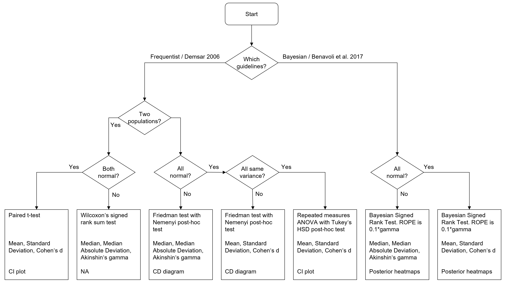
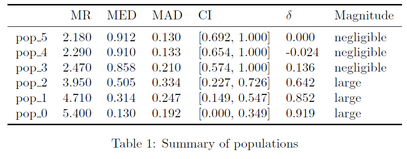

# Autorank

[](https://github.com/sherbold/autorank/actions)
[](https://codecov.io/gh/sherbold/autorank)
[](https://doi.org/10.21105/joss.02173)
[](https://badge.fury.io/py/autorank)

## Summary

Autorank is a simple Python package with one task: simplify the comparison between (multiple) paired populations. This
is, for example, required if the performance of different machine learning algorithms or simulations should be compared 
on multiple data sets. The performance measures on each data set are then the paired samples, the difference in the
central tendency (e.g., the mean or median) can be used to rank the different algorithms. This problem is not new and
how such tests could be done was already described in 2006  in the well-known article _Janez Demšar. 2006. Statistical
Comparisons of Classifiers over Multiple Data Sets. J. Mach. Learn. Res. 7 (December 2006), 1–30_. 

Regardless, the correct use of Demšar guidelines is hard for non-experts in statistics. Correct use of the guidelines
requires the decision of whether a paired t-test, a Wilcoxon's rank sum test, repeated measures ANOVA with Tukey's HSD 
as post-hoc test, or Friedman's tests and Nemenyi's post-hoc test to determine an answer to the question if there are
differences. For this, the distribution of the populations must be analyzed with the Shapiro-Wilk test for normality
and, depending on the normality with Levene's test or Bartlett's tests for homogeneity of the data. All this is already
quite complex. This does not yet account for the adjustment of the significance level in case of repeated tests to
achieve the desired family-wise significance. Additionally, not only the tests should be conducted, but good reporting
of the results also include confidence intervals, effect sizes, and the decision of whether it is appropriate to report
the mean value and standard deviation, or whether the median value and the median absolute deviation is more
appropriate.

Moreover, Bayesian statistics have become more popular in recent years. There is even a follow up article co-authored
by Janez Demšar that suggest to use Bayesian statistics: _Alessio Benavoli, Giorgio Corani, Janez Demšar, Marco
Zaffalon. 2017. Time for a Change: a Tutorial for Comparing Multiple Classifiers Through Bayesian Analysis. J. Mach.
Learn. Res. 18(77), 1-36_. There are two main advantages of the Bayesian approach. 1) Instead of an indirect assessment
of the hypothesis that something is equal or different through a p-value, Bayesian statistics directly computes the
probability that the central tendency of a population is smaller, equal, or larger than that of other populations. 2)
The definition of a Region of Practical Equivalence (ROPE) allows the definition of differences are too small to be 
practically relevant, which enables the Bayesian approach to determine equality of populations.  

The goal of Autorank is to simplify the statistical analysis for non-experts. Autorank takes care of all of the above
with a single function call, both for the traditional *frequentist* approach (Guidelines from 2006), as well as for the
*Bayesian* approach (Guidelines from 2017). Additional functions allow the generation of appropriate plots, result
tables, and even of a complete latex document. All that is required is the data about the populations is in a 
[Pandas](https://pandas.pydata.org/) dataframe.   


## How to cite Autorank

```
@article{Herbold2020,
  doi = {10.21105/joss.02173},
  url = {https://doi.org/10.21105/joss.02173},
  year = {2020},
  publisher = {The Open Journal},
  volume = {5},
  number = {48},
  pages = {2173},
  author = {Steffen Herbold},
  title = {Autorank: A Python package for automated ranking of classifiers},
  journal = {Journal of Open Source Software}
}
```

## Installation

Autorank is available on PyPi and can be installed using pip.

```
pip install autorank
```

You can also clone this repository and install the latest development version (requires git and setuptools).
```
git clone https://github.com/sherbold/autorank
cd autorank
python setup.py install
```

## API Documentation

You can find the API documentation of the current master of autorank
[online](https://sherbold.github.io/autorank/autorank/).

## Description

The following flow chart summarizes the decisions made by autorank.
 


The user has to decide if the frequentist approach based on the guidelines from 2006 or the Bayesian approach based on
the guidelines from 2017 is used. Afterwards, autorank does the rest on its own. 

### Normality and Statistical Markers

Autorank determines if all populations are normal to select appropriate statistical markers for reporting.  
- First all populations are checked with the Shapiro-Wilk test for normality. We use Bonferoni correction for these
  tests, i.e., alpha/#populations.
- Based on the normality and the homogeneity, we select appropriate tests, effect sizes, and methods for determining
  the confidence intervals of the central tendency.

If all columns are normal, we calculate:
- The mean value as central tendency.
- The empirical standard deviation as measure for the variance.
- The confidence interval for the mean value.
- The effect size in comparison to the highest mean value using Cohen's d.

If at least one column is not normal, we calculate:
- The median as central tendency.
- The median absolute deviation from the median as measure for the variance.
- The confidence interval for the median.
- The effect size in comparison to the highest ranking approach using
[Akinshin's gamma](https://aakinshin.net/posts/nonparametric-effect-size/).

### Frequentist Tests (2006 Guidelines)

The appropriate statistical test for the frequentist approach is determined based on the normality of the data, the
homogeneity of the populations (equal variances), and the number of populations. The best test for homogeneity depends
on the normality of the data. 
- If all columns are normal, we use Bartlett's test for homogeneity, otherwise we use Levene's test.

We then have four variants for statistical testing. 
- If there are two populations and both populations are normal, we use the paired t-test.
- If there are two populations and at least one populations is not normal, we use Wilcoxon's signed rank test.
- If there are more than two populations and all populations are normal and homoscedastic, we use repeated measures
  ANOVA with Tukey's HSD as post-hoc test.
- If there are more than two populations and at least one populations is not normal or the populations are
  heteroscedastic, we use Friedman's test with the Nemenyi post-hoc test.

### Bayesian Tests (2017 Guidelines)

For the Bayesian approach, we can use the Bayesian Signed Rank test, which makes no assumptions on the data. The
critical aspect of this test is the Region Of Practical Equivalence (ROPE) that defines when differences are practically
irrelevant. If not configured otherwise, autorank determines the ROPE as follows. 
- For normal data, the ROPE is defined as 0.1*STD, where STD is the standard deviation. This means the ROPE is the area
  with an effect size of less than d=0.1 (Cohen's d).
- For non-normal data, the ROPE is defined as 0.1*MAD, where MAD is the mean absolute deviation of the median. This means
  the ROPE is the area with an effect size of less than gamma=0.1 (Akinshin's gamma)

This follows [Kruschke and Liddell, 2018](https://doi.org/10.3758/s13423-016-1221-4), who suggest to determine the ROPE
as half the size of a small effect. Since a small
effect with Cohen's d is 0.2, this means that a ROPE of 0.1*d translates to a considering all differences that are not
even half of a small effect as practically equivalent. The same concept is applied with Akinshin's gamma, which is a
direct translation of the concept of Cohen's d to robust statistics based on the median absolute deviation instead
of the standard deviation.  

Users of autorank can define their own ROPE either with a different ratio of the effect size or using a fixed range for
the ROPE. 


### Implementation

We use the paired t-test, the Wilcoxon signed rank test, and the Friedman test from [scipy](https://www.scipy.org/). The
repeated measures ANOVA and Tukey's HSD test (including the calculation of the confidence intervals) are used from
[statsmodels](statsmodels). We use the Bayesian signed rank test from the [baycomp](https://github.com/janezd/baycomp)
package. We use own implementations for the calculation of critical distance of the Nemenyi test, the calculation of the
effect sizes, and the calculation of the confidence intervals (with the exception of Tukey's HSD).

  
## Usage Example

The following example shows the usage of `autorank`. First, we import the functions from autorank and create some data. 
```python
import numpy as np
import pandas as pd
import matplotlib.pyplot as plt
from autorank import autorank, plot_stats, create_report, latex_table

np.random.seed(42)
pd.set_option('display.max_columns', 7)
std = 0.3
means = [0.2, 0.3, 0.5, 0.8, 0.85, 0.9]
sample_size = 50
data = pd.DataFrame()
for i, mean in enumerate(means):
    data['pop_%i' % i] = np.random.normal(mean, std, sample_size).clip(0, 1)
```

The statistical analysis of the data only requires a single command. As a result, you get a named tuple with all
relevant information from the statistical analysis conducted.  
```python
result = autorank(data, alpha=0.05, verbose=False)
print(result)
``` 
Output: 
```
RankResult(rankdf=
       meanrank    median       mad  ci_lower  ci_upper  effect_size    mangitude
pop_5      2.18  0.912005  0.130461  0.692127         1  2.66454e-17   negligible
pop_4      2.29  0.910437  0.132786  0.654001         1       -0.024   negligible
pop_3      2.47  0.858091  0.210394  0.573879         1       0.1364   negligible
pop_2      3.95  0.505057  0.333594  0.227184   0.72558       0.6424        large
pop_1      4.71  0.313824  0.247339  0.149473  0.546571       0.8516        large
pop_0      5.40  0.129756  0.192377         0  0.349014       0.9192        large
pvalue=2.3412212612346733e-28
cd=1.0662484349869374
omnibus='friedman'
posthoc='nemenyi'
all_normal=False
pvals_shapiro=[1.646607051952742e-05, 0.0605173334479332, 0.13884511590003967, 0.00010030837438534945,
               2.066387423838023e-06, 1.5319776593969436e-06]
homoscedastic=True
pval_homogeneity=0.2663177301695518
homogeneity_test='levene'
alpha=0.05
alpha_normality=0.008333333333333333 
num_samples=50
posterior_matrix=
None
decision_matrix=
None
rope=None
rope_mode=None
effect_size=akinshin_gamma)
```

By default, autorank performs a frequentist analysis. If you want to conduct a Bayesian analysis, you simple have to
define this in the call of the `autorank` function. Please not that the Bayesian analysis is computationally expensive,
so do not worry if this requires a couple of seconds (or in case of many populations, even minutes). 

```python
result_bayesian = autorank(data, alpha=0.05, verbose=False, approach='bayesian')
```
Output:
```
RankResult(rankdf=
         median       mad  ci_lower  ci_upper effect_size   magnitude  p_equal  p_smaller      decision
pop_5  0.912005  0.130461  0.605547         1           0  negligible      NaN        NaN            NA 
pop_4  0.910437  0.132786   0.63089         1   0.0119148  negligible      0.0    0.66490  inconclusive 
pop_3  0.858091  0.210394  0.545962         1    0.307991       small      0.0    0.81552  inconclusive  
pop_2  0.505057  0.333594  0.181309  0.744055     1.60669       large      0.0    1.00000       smaller 
pop_1  0.313824  0.247339  0.106464  0.590593     3.02519       large      0.0    1.00000       smaller 
pop_0  0.129756  0.192377         0   0.42154     4.75934       large      0.0    1.00000       smaller
pvalue=None
cd=None
omnibus=bayes
posthoc=bayes
all_normal=False
pvals_shapiro=[1.646607051952742e-05, 0.0605173334479332, 0.13884511590003967, 0.00010030837438534945, 2.066387423838023e-06, 1.5319776593969436e-06]
homoscedastic=None
pval_homogeneity=None
homogeneity_test=None
alpha=0.05
alpha_normality=0.008333333333333333
num_samples=50
posterior_matrix=
      pop_5                  pop_4                    pop_3            pop_2                    pop_1                    pop_0 
pop_5   NaN  (0.6649, 0.0, 0.3351)  (0.81552, 0.0, 0.18448)  (1.0, 0.0, 0.0)          (1.0, 0.0, 0.0)          (1.0, 0.0, 0.0)  
pop_4   NaN                    NaN  (0.80308, 0.0, 0.19692)  (1.0, 0.0, 0.0)          (1.0, 0.0, 0.0)          (1.0, 0.0, 0.0) 
pop_3   NaN                    NaN                      NaN  (1.0, 0.0, 0.0)          (1.0, 0.0, 0.0)          (1.0, 0.0, 0.0)
pop_2   NaN                    NaN                      NaN              NaN  (0.99538, 0.0, 0.00462)          (1.0, 0.0, 0.0)  
pop_1   NaN                    NaN                      NaN              NaN                      NaN  (0.99938, 0.0, 0.00062)
pop_0   NaN                    NaN                      NaN              NaN                      NaN                      NaN
decision_matrix=
              pop_5         pop_4         pop_3    pop_2    pop_1    pop_0
pop_5           NaN  inconclusive  inconclusive  smaller  smaller  smaller
pop_4  inconclusive           NaN  inconclusive  smaller  smaller  smaller
pop_3  inconclusive  inconclusive           NaN  smaller  smaller  smaller
pop_2        larger        larger        larger      NaN  smaller  smaller
pop_1        larger        larger        larger   larger      NaN  smaller
pop_0        larger        larger        larger   larger   larger      NaN
rope=0.1
rope_mode=effsize
effect_size=akinshin_gamma)
```

You can go ahead and use this tuple to create your own report about the statistical analysis. Alternatively, you can use
autorank for this task.  
```python
create_report(result)
```
Output:
```
The statistical analysis was conducted for 6 populations with 50 paired samples.
The family-wise significance level of the tests is alpha=0.050.
We rejected the null hypothesis that the population is normal for the populations pop_5 (p=0.000), pop_2 (p=0.000), 
pop_1 (p=0.000), and pop_0 (p=0.000). Therefore, we assume that not all populations are normal.
Because we have more than two populations and the populations and some of them are not normal, we use the 
non-parametric Friedman test as omnibus test to determine if there are any significant differences between the 
median values of the populations. We use the post-hoc Nemenyi test to infer which differences are significant. We report
the median (MD), the median absolute deviation (MAD) and the mean rank (MR) among all populations over the samples. 
Differences between populations are significant, if the difference of the mean rank is greater than the critical 
distance CD=1.066 of the Nemenyi test.
We reject the null hypothesis (p=0.000) of the Friedman test that there is no difference in the central tendency of 
the populations pop_5 (MD=0.912+-0.154, MAD=0.130, MR=2.180), pop_4 (MD=0.910+-0.173, MAD=0.133, MR=2.290), pop_3 
(MD=0.858+-0.213, MAD=0.210, MR=2.470), pop_2 (MD=0.505+-0.249, MAD=0.334, MR=3.950), pop_1 (MD=0.314+-0.199, 
MAD=0.247, MR=4.710), and pop_0 (MD=0.130+-0.175, MAD=0.192, MR=5.400). Therefore, we assume that there is a 
statistically significant difference between the median values of the populations.
Based on the post-hoc Nemenyi test, we assume that there are no significant differences within the following groups: 
pop_5, pop_4, and pop_3; pop_2 and pop_1; pop_1 and pop_0. All other differences are significant.
```

Or you could use Autorank to generate a plot that visualizes the statistical analysis. Autorank creates plots of the
confidence interval in case of the paired t-test and repeated measures ANOVA and a critical distance diagram for the
post-hoc Nemenyi test. 

```python
plot_stats(result)
plt.show()
```

For the above example, the following plot is created:


To further support reporting in scholarly article, Autorank can also generate a latex table with the relevant results. 
```python
latex_table(result)
```
Output:
```
\begin{table}[h]
\centering
\begin{tabular}{lrrllll}
\toprule
{} &    MR &   MED &   MAD &              CI & $\gamma$ &   Magnitude \\
\midrule
pop\_5 & 2.180 & 0.912 & 0.130 &  [0.692, 1.000] &     0.000 &  negligible \\
pop\_4 & 2.290 & 0.910 & 0.133 &  [0.654, 1.000] &     0.012 &  negligible \\
pop\_3 & 2.470 & 0.858 & 0.210 &  [0.574, 1.000] &     0.308 &       small \\
pop\_2 & 3.950 & 0.505 & 0.334 &  [0.227, 0.726] &     1.607 &       large \\
pop\_1 & 4.710 & 0.314 & 0.247 &  [0.149, 0.547] &     3.025 &       large \\
pop\_0 & 5.400 & 0.130 & 0.192 &  [0.000, 0.349] &     4.759 &       large \\
\bottomrule
\end{tabular}
\caption{Summary of populations}
\label{tbl:stat_results}
\end{table}
```

The rendered table looks like this (may change depending on the class of the document).
 


## Creating a Local Developer Environment

If you want to modify the code of autorank, we recommend that you setup a local development environment with a 
virtual environment as follows. 

```
git clone https://github.com/sherbold/autorank
cd autorank
python3 -m venv .
source bin/activate
pip install .
```

You can run the tests to check if everything works. 

```
python -m unittest
```

## Contributing

Contributions to Autorank are welcome.

- Just file an [Issue](https://github.com/sherbold/autorank/issues) to ask questions, report bugs, or request new
features. 
- Pull requests via GitHub are also welcome.

Potential contributions include more detailed report generation or the extension of Autorank to more types of data,
e.g., independent populations, or paired populations with unequal sample sizes.   


## License

Autorank is published under the Apache 2.0 Licence.
