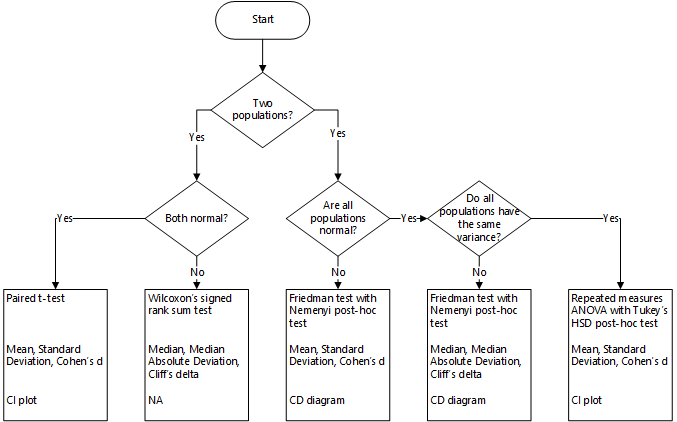

# Summary

Analyses to determine differences in the central tendency, e.g., mean or median values, are an
important application of statistics. Often, such comparisons must be done with paired samples, i.e., populations that
are not dependent on each other. This is, for example, required if the performance different machine learning algorithms
should be compared on multiple data sets. The performance measures on each data set are then the paired samples, the
difference in the central tendency can be used to rank the different algorithms. This problem is not new and how such
tests could be done was already described in the well-known article by @Demsar2006. 

Regardless, the correct use of Demšar's guidelines is hard for non-experts in statistics. The distribution of the
populations must be analyzed with the Shapiro-Wilk test for normality and, depending on the normality with Levene's 
test or Bartlett's tests for homogeneity of the data. Based on the results and the number of populations, 
researchers must decide
whether the paired t-test, Wilcoxon's rank sum test, repeated measures ANOVA with Tukey's HSD 
as post-hoc test, or Friedman's tests and Nemenyi's post-hoc test is the suitable statistical framework. 
All this is already quite complex. Additionally, researchers must adjust the significance level due to the number of
tests to achieve the desired family-wise significance and control the false-positive rate of the test results. 

Moreover, there are important aspects that go beyond Demšar's guidelines regarding best practice for the reporting of
statistical result. Good reporting of the results goes beyond simply stating the signficance of findings. Instead,
additional aspect such as effect sizes, confidence intervals, and the decision whether it is appropriate to report the 
mean value and standard deviation, or whether the median value and the median absolute deviation are better suited.

The goal of Autorank is to simplify the statistical analysis for non-experts. Autorank takes care of all of the above
with a single function call. The decision flow of Autorank is as follows.




Additional functions allow the generation of appropriate plots, result tables, and even of
a complete latex document. All that is required is the data about the populations is in a dataframe. 


We believe that Autorank can help to avoid common statistical errors such as, such as the use of inappropriate
statistical tests, reporting of parametric measures instead of non-parametric measures in case of non-normal data, and
incomplete reporting in general. 


# Using Autorank

In our research, we recently used autorank to compare differences between data generation methods for defect prediction
research [@Herbold2020]. In general, Autorank can be used anywhere, where different classifiers are compared on multiple
data sets. The results must only be prepared as a dataframe. For example, the dataframe could contain the accuracy of
classifiers trained on different data sets [^1]. The following three lines would then perform the statistical tests,
generate the textual description of the results, as well as the plot of the results. 

```python
> from autorank import autorank, create_report, plot_stats
> results = autorank(data)
> create_report(results)
The statistical analysis was conducted for 6 populations with 20 paired samples.
The family-wise significance level of the tests is alpha=0.050.
We rejected the null hypothesis that the population is normal for the population Random Forest (p=0.000). Therefore, we assume that not all populations are normal.
Because we have more than two populations and the populations and one of them is not normal, we use the non-parametric Friedman test as omnibus test to determine if there are any significant differences between the median values of the populations. We use the post-hoc Nemenyi test to infer which differences are significant. We report the median (MD), the median absolute deviation (MAD) and the mean rank (MR) among all populations over the samples. Differences between populations are significant, if the difference of the mean rank is greater than the critical distance CD=1.686 of the Nemenyi test.
We reject the null hypothesis (p=0.000) of the Friedman test that there is no difference in the central tendency of the populations Naive Bayes (MD=0.875+-0.065, MAD=0.053, MR=2.750), Random Forest (MD=0.850+-0.100, MAD=0.062, MR=2.850), RBF SVM (MD=0.885+-0.217, MAD=0.059, MR=2.900), Neural Net (MD=0.876+-0.070, MAD=0.045, MR=3.300), Decision Tree (MD=0.810+-0.173, MAD=0.074, MR=4.525), and Linear SVM (MD=0.710+-0.245, MAD=0.253, MR=4.675). Therefore, we assume that there is a statistically significant difference between the median values of the populations.
Based the post-hoc Nemenyi test, we assume that there are no significant differences within the following groups: Naive Bayes, Random Forest, RBF SVM, and Neural Net; Random Forest, RBF SVM, Neural Net, and Decision Tree; Neural Net, Decision Tree, and Linear SVM. All other differences are significant.

> plot_stats(data)
```


# Acknowledgements

This work is partially funded by DFG Grant 402774445.

# References

[^1] See also: https://github.com/sherbold/autorank/tree/master/examples/sklearn.py